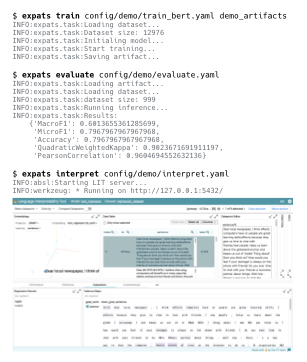

# EXPATS: A Toolkit for Explainable Automated Text Scoring



EXPATS is an open-source framework for automated text scoring (ATS) tasks, such as automated essay scoring and readability assessment. Users can develop and experiment with different ATS models quickly by using the toolkit's easy-to-use components, the configuration system, and the command-line interface. The toolkit also provides seamless integration with [the Language Interpretability Tool (LIT)](https://pair-code.github.io/lit/) so that one can interpret and visualize models and their predictions. 

## Requirements

- [poetry](https://python-poetry.org/)
    
## Usage

1. Clone this repository.

```bash
$ git clone git@github.com:octanove/expats.git
$ cd expats
```

2. Install Python dependencies via poetry, and launch an interactive shell

```bash
$ poetry install
$ poetry shell
```

3. Prepare the dataset for your task

We'll use ASAP-AES, a standard dataset for autoamted essay scoring. You can download the dataset from [the Kaggle page](https://www.kaggle.com/c/asap-aes). EXPATS supports a dataset reader for ASAP-AES by default.

4. Write a config file

In the config file, you specify the type of the task (`task`), the type of the profiler (`profiler`) and its hyperparmeters, and the dataset to use (`dataset`). An example config file for training a BERT-based regressor for ASAP-AES is shown below.

```bash
$ cat config/asap_aes/train_bert.yaml
task: regression

profiler:
    type: TransformerRegressor
    params:
      trainer:
        gpus: 1
        max_epochs: 80
        accumulate_grad_batches: 2
      network:
        output_normalized: true
        pretrained_model_name_or_path: bert-base-uncased
        lr: 4e-5
      data_loader:
        batch_size: 8
      val_ratio: 0.2
      max_length: null

dataset:
    type: asap-aes
    params:
        path: data/asap-aes/training_set_rel3.tsv
```

5. Train your model

You can train the model by running the `expats train` command as shown below. 

```bash
$ poetry run expats train config/asap_aes/train_bert.yaml artifacts
```

The result (e.g., log file, the model weights) is stored in the directory `artifacts`.

6. Evalute your model

You can evaluate your model by running:

```bash
$ poetry run expats evaluate config/asap_aes/evaluate.yaml
```

You can also configure the evaluation settings by modifying the configuration file.

7. Interpret your model

You can launch the LIT server to interpret and visualize the trained model and its behavior:
```bash
$ poetry run expats interpret config/asap_aes/interpret.yaml
```
